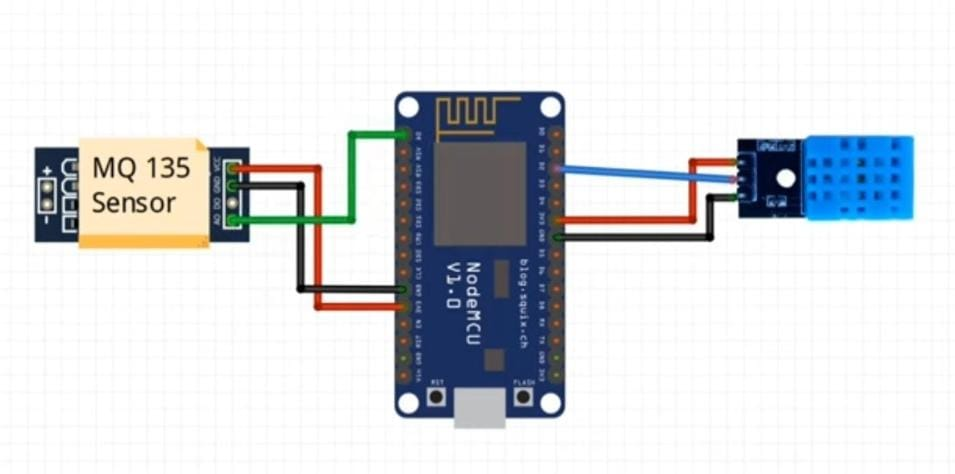
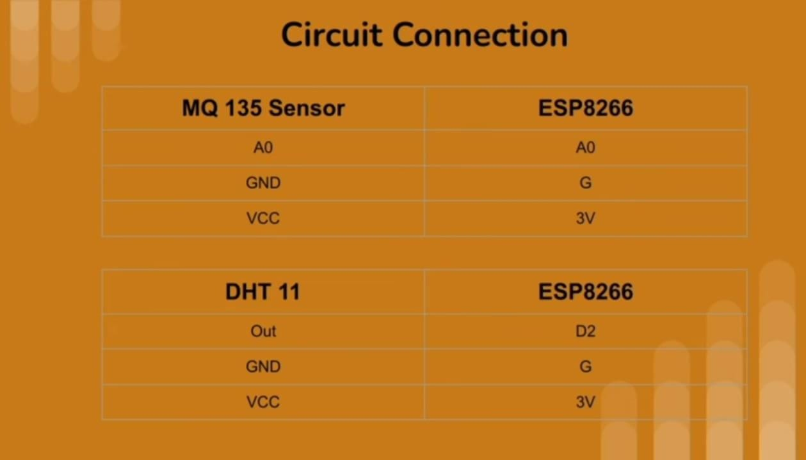

# Air Quality Monitoring System 🌍

## Overview

The Air Quality Monitoring System is an IoT-based project developed to monitor environmental conditions in real time. The system measures air quality, temperature, and humidity using sensors and displays the collected data through the Arduino IoT Cloud platform.

## Technologies Used

- Arduino IoT Cloud
- ESP8266 NodeMCU
- Arduino IDE
- Embedded C/C++
- IoT

## Components Used

- ESP8266 NodeMCU
- MQ135 Air Quality Sensor
- DHT11 Temperature & Humidity Sensor
- Breadboard
- Jumper Wires

## Features

- Real-time Air Quality Monitoring
- Temperature Monitoring
- Humidity Monitoring
- Cloud-Based Data Visualization
- Environmental Condition Tracking
- IoT Dashboard Integration

## Hardware Connection Diagram

## Circuit Diagram

## Source Code

The project source code is available in the `Source_Code` folder.

The system collects data from:
- MQ135 Air Quality Sensor
- DHT11 Temperature & Humidity Sensor

and uploads the readings to Arduino IoT Cloud for monitoring and analysis.

## Project Report

📄 Complete project documentation is available in:

[View Project Report](./10Report%20(7).pdf)

## Learning Outcomes

Through this project, I gained practical experience in:

- Internet of Things (IoT)
- Sensor Integration
- Embedded Programming
- Real-Time Data Monitoring
- Cloud Connectivity
- Hardware-Software Communication

## Future Improvements

- Mobile Notifications
- AQI Classification System
- Historical Data Analysis
- Smart Alert System
- Advanced Dashboard Visualization

## Author

**Arya Pandurang Gawade**
